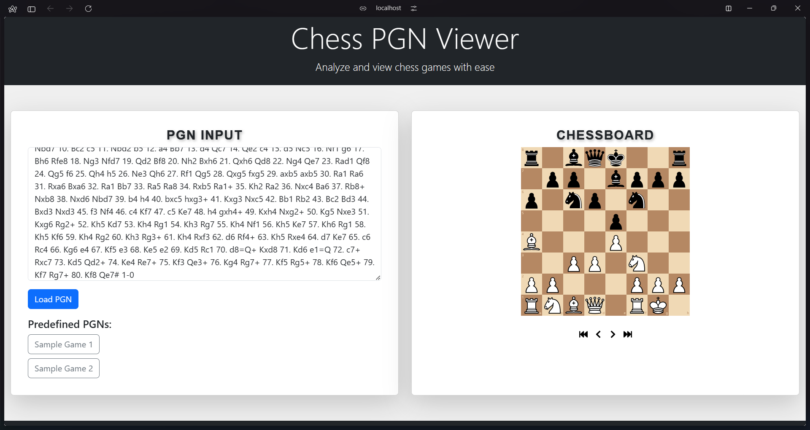

# Chess Notation Viewer



## Overview

The **Chess PGN Viewer** is a web application that allows users to paste PGN (Portable Game Notation) text of a chess game and view the game moves on an interactive chessboard. This tool is useful for chess enthusiasts who want to review and analyze their games.

## Features

- Paste PGN text containing chess moves.
- Display an interactive chessboard to review the game.
- Navigate through the moves to analyze the game step-by-step.
- Simple and intuitive user interface.

## Table of Contents

- [Installation](#installation)
- [Usage](#usage)
- [Contributing](#contributing)


## Installation

To set up the project locally, follow these steps:

1. **Clone the repository:**

   ```bash
   git clone https://github.com/Vanshpanchal/Chess-Notation-Viewer.git
   ```

2. **Navigate to the project directory:**

   ```bash
   cd Chess-Notation-Viewer
   ```

3. **Install the dependencies:**

   Make sure you have Node.js installed. Then run:

   ```bash
   npm install
   ```

4. **Start the development server:**

   ```bash
   npm start
   ```

   The application should now be running on `http://localhost:3000`.

## Usage

### Step 1: Open the Application

Once the server is running, open your browser and navigate to `http://localhost:3000`.

### Step 2: Paste PGN Text

- Copy the PGN text from your source (e.g., a chess website, document, etc.).
- Paste the PGN text into the designated input area in the application.


### Step 3: View the Chess Game

- The pasted game will be displayed on the chessboard.
- Use the navigation controls to move through the game step-by-step.

### Step 4: Analyze the Game

- You can analyze the game by stepping through each move.
- The notation of each move is displayed alongside the chessboard.


## Contributing

Contributions are welcome! If you would like to contribute, please fork the repository and create a pull request with your changes. For major changes, please open an issue first to discuss what you would like to change.

1. Fork the Project
2. Create your Feature Branch (`git checkout -b feature/AmazingFeature`)
3. Commit your Changes (`git commit -m 'Add some AmazingFeature'`)
4. Push to the Branch (`git push origin feature/AmazingFeature`)
5. Open a Pull Request
